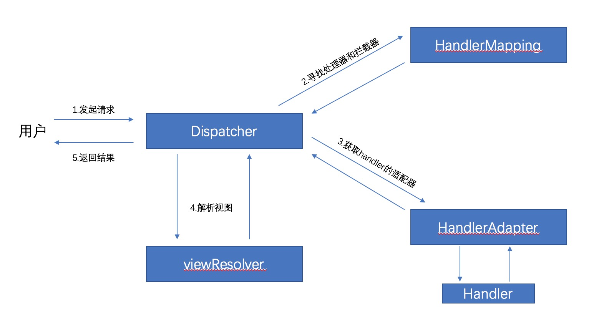

##前言

一次为了解决跨域问题，采用了CORS方法。根据[官方解释](https://developer.mozilla.org/zh-CN/docs/Web/HTTP/Access_control_CORS)，只需要在响应头里设置
1、Access-Control-Allow-Origin
2、Access-Control-Allow-Methods
3、Access-Control-Allow-Headers
三个值就可以了，于是想到在HandlerInterceptor#preHandle()里去拦截跨域请求(options)，然后再根据自定义注解判断请求的controller是否支持跨域请求，再设置对应的响应头。（项目基于spring3.2.x）但是发现请求死活无法进入preHandle里(项目里只有一个自定义的preHandle，不存在提前被别的HandlerInterceptor返回的情况)。于是利用debug大法，发现spring获取拦截器时是根据url和请求类型进行判断的，由于跨域请类型是options，无法获取对于的handler和HandlerInterceptor，导致直接就返回了，没有进入拦截器里。（spring4.x后有个默认的handler支持处理options）。于是把debug过程中学习到的知识，下次排查问题可以更快。


## Dispathcher处理请求的流程概览



| 组件           | 说明                                                         |
| -------------- | ------------------------------------------------------------ |
| Dispatcher     | 负责接收用户请求，并且协调内部的各个组件完成请求的响应       |
| HandlerMapping | 通过request获取handler和interceptors                         |
| HandlerAdapter | 处理器的适配器。Spring 中的处理器的实现多变，可以通过实现 Controller 接口，也可以用 @RequestMapping 注解将方法作为一个处理器等，这就导致调用处理器是不确定的。所以这里需要一个处理器适配器，统一调用逻辑。 |
| ViewResolver   | 解析视图，返回数据                                           |

## Dispathcer的继承图


从继承视图可以看出，Dispatcher是Servlet的一个实现类。也就是遵循了J2EE规范的处理器。

Servlet是一个接口，包含以下方法

```java
public interface Servlet {
   
    /**
    * 对配置文件（web.xml）的解析，初始化
    */
    public void init(ServletConfig config) throws ServletException;

    public ServletConfig getServletConfig();

    /**
    * 业务逻辑实现在该方法内
    * 该方法会被Web容器（如：Tomcat）调用
    */
    public void service(ServletRequest req, ServletResponse res)
            throws ServletException, IOException;

    public String getServletInfo();

    public void destroy();
}

```

HttpServlet这个类是和 HTTP 协议相关。该类的关注点在于怎么处理 HTTP 请求，比如其定义了 doGet 方法处理 GET 类型的请求，定义了 doPost 方法处理 POST 类型的请求等。我们若需要基于 Servlet 写 Web 应用，应继承该类，并覆盖指定的方法。所有的处理get请求、post请求都是由service 方法进行调用的。如下：

```java
public abstract class HttpServlet extends GenericServlet
        implements java.io.Serializable {
  
  /**
    *实现Servlet的service方法,并且将请求转为http请求
    *调用内部方法service(HttpServletRequest req, HttpServletResponse resp)，处理http请求
    *
    */
  public void service(ServletRequest req, ServletResponse res)
            throws ServletException, IOException {
        HttpServletRequest request;
        HttpServletResponse response;

        try {
            request = (HttpServletRequest) req;
            response = (HttpServletResponse) res;
        } catch (ClassCastException e) {
            throw new ServletException("non-HTTP request or response");
        }
        service(request, response);
    }
  
  /**
    *http请求的分发
    */
   protected void service(HttpServletRequest req, HttpServletResponse resp)
            throws ServletException, IOException {
        String method = req.getMethod();

        if (method.equals(METHOD_GET)) {
            long lastModified = getLastModified(req);
            if (lastModified == -1) {
                // servlet doesn't support if-modified-since, no reason
                // to go through further expensive logic
                doGet(req, resp);
            } else {
                long ifModifiedSince = req.getDateHeader(HEADER_IFMODSINCE);
                    doGet(req, resp);
                } else {
                    resp.setStatus(HttpServletResponse.SC_NOT_MODIFIED);
                }
            }

        } else if (method.equals(METHOD_HEAD)) {
            long lastModified = getLastModified(req);
            maybeSetLastModified(resp, lastModified);
            doHead(req, resp);

        } else if (method.equals(METHOD_POST)) {
            doPost(req, resp);

        } else if (method.equals(METHOD_PUT)) {
            doPut(req, resp);

        } else if (method.equals(METHOD_DELETE)) {
            doDelete(req, resp);

        } else if (method.equals(METHOD_OPTIONS)) {
            doOptions(req, resp);

        } else if (method.equals(METHOD_TRACE)) {
            doTrace(req, resp);

        }
    }
  
    //其他方法
}
        
```

Dispatcher没有直接实现servlet，而是继承了HttpServlet。对于http请求的处理流程：

`HttpServlet.service -> FrameworkServlet.service -> FrameworkServlet.processRequest -> DispatcherServlet.doService -> DispatcherServlet.doDispatch`

##Dispatcher#doDispatch

Dispatcher对请求进行处理在doDispatch方法里

```java
// 省略了内部实现，只看核心的地方
protected void doDispatch(HttpServletRequest request, HttpServletResponse response) throws Exception {
   //S1 先获取到请求的处理器Handler和拦截器interceptors
   HandlerExecutionChain mappedHandler = getHandler(processedRequest, false);
		if (mappedHandler == null || mappedHandler.getHandler() == null) {
			noHandlerFound(processedRequest, response);
			return;
		}
  /*
   * S2
   * 执行拦截器，一般自定义的HandlerInterceptor#preHandle就是在这里执行的
   * 里面也很简单，就是一个for循环，不停的执行preHandle方法，直到某个拦截器返回false
   * 或者循环结束
   */
  if (!mappedHandler.applyPreHandle(processedRequest, response)) {
					return;
	 }
  
  //S3 获取Handler对于的HandlerAdapter,负责调用Handler获取结果
	HandlerAdapter ha = getHandlerAdapter(mappedHandler.getHandler());
  
  //S4 执行handler#handle,返回ModelAndView
  ModelAndView mv = ha.handle(processedRequest, response, mappedHandler.getHandler());
  
  //S5 同理，一个for循环执行HandlerInterceptor#postHandle
  mappedHandler.applyPostHandle(processedRequest, response, mv);
  
  //S6 解析并渲染视图
  processDispatchResult(processedRequest, response, mappedHandler, mv, dispatchException);
}
```

以上比较核心的三步是：

1、获取HandlerExecutionChain，也就是处理器和拦截器

2、获取handler的adapter

3、执行handler#handle，返回结果

下面分别看下三个步骤的实现

##获取HandlerExecutionChain

```java
//HandlerExecutionChain mappedHandler = getHandler(processedRequest, false);
protected HandlerExecutionChain getHandler(HttpServletRequest request) throws Exception {
   for (HandlerMapping hm : this.handlerMappings) {
      if (logger.isTraceEnabled()) {
         logger.trace(
               "Testing handler map [" + hm + "] in DispatcherServlet with name '" + getServletName() + "'");
      }
      HandlerExecutionChain handler = hm.getHandler(request);
      if (handler != null) {
         return handler;
      }
   }
   return null;
}
```

逻辑很简单：for循环去匹配request对应的HandlerExecutionChain，其中handlerMappings被定义为List<HandlerMapping>。HandlerMapping是一个接口，继承关系如下：


HandlerMapping的getHandler方法如下：

```java
//省略内部实现
public final HandlerExecutionChain getHandler(HttpServletRequest request) throws Exception { 
   Object handler = getHandlerInternal(request);
   return getHandlerExecutionChain(handler, request);
}
```

1、通过getHandlerInternal获取handler，是一个模板方法，由子类具有去实现，主要有两个实现

1.1、AbstractHandlerMethodMapping#getHandlerInternal

```java
protected HandlerMethod getHandlerInternal(HttpServletRequest request) throws Exception {
		String lookupPath = getUrlPathHelper().getLookupPathForRequest(request);
		HandlerMethod handlerMethod = lookupHandlerMethod(lookupPath, request);
	}
```

1.2、AbstractUrlHandlerMapping#getHandlerInternal

```java
protected Object getHandlerInternal(HttpServletRequest request) throws Exception {
		String lookupPath = getUrlPathHelper().getLookupPathForRequest(request);
		Object handler = lookupHandler(lookupPath, request);
	}
```

寻找handler的方法都是获取request的请求url，然后根据url去获取controller了。这里也就是使用@RequestMapping注解的方法。

以lookupHandler为例

```java
protected Object lookupHandler(String urlPath, HttpServletRequest request) throws Exception {
		// 能直接匹配就返回，比如 "/test" matches "/test"
		Object handler = this.handlerMap.get(urlPath);
		if (handler != null) {
			validateHandler(handler, request);
			return buildPathExposingHandler(handler, urlPath, urlPath, null);
		}
		// "/t*" matches both "/test" and "/team"
		List<String> matchingPatterns = new ArrayList<String>();
		for (String registeredPattern : this.handlerMap.keySet()) {
			if (getPathMatcher().match(registeredPattern, urlPath)) {
				matchingPatterns.add(registeredPattern);
			}
		}
    // spring官方解释，按照最长路径进行匹配
		String bestPatternMatch = null;
		Comparator<String> patternComparator = getPathMatcher().getPatternComparator(urlPath);
		if (!matchingPatterns.isEmpty()) {
			Collections.sort(matchingPatterns, patternComparator);
			if (logger.isDebugEnabled()) {
				logger.debug("Matching patterns for request [" + urlPath + "] are " + matchingPatterns);
			}
			bestPatternMatch = matchingPatterns.get(0);
		}
		if (bestPatternMatch != null) {
			handler = this.handlerMap.get(bestPatternMatch);
			validateHandler(handler, request);
    }
```

这里的核心是**this.handlerMap.get(urlPath)**，所以的操作都是为了从map从获取数据。map是怎么被初始化的呢？

**map是通过registerHandler方法初始化的**，每个子类都可以覆盖该方法，实现自己的数据初始化，但是最终的匹配handler过程是由父类统一实现的。实现了数据和操作的分离。

registerHandler也很简单，先根据url从map中取handler，如果存在多个handler则报错（一个url无法对应多个handler）。

没有则存入handler。

2、找到拦截器，将处理器和拦截器封装后返回。

```java
/**
 * 获取拦截器的逻辑比较简单，也是url匹配
 */
protected HandlerExecutionChain getHandlerExecutionChain(Object handler, HttpServletRequest request) {
		HandlerExecutionChain chain = (handler instanceof HandlerExecutionChain ?
				(HandlerExecutionChain) handler : new HandlerExecutionChain(handler));
		chain.addInterceptors(getAdaptedInterceptors());

		String lookupPath = this.urlPathHelper.getLookupPathForRequest(request);
		for (MappedInterceptor mappedInterceptor : this.mappedInterceptors) {
			if (mappedInterceptor.matches(lookupPath, this.pathMatcher)) {
				chain.addInterceptor(mappedInterceptor.getInterceptor());
			}
		}

		return chain;
	}
```

```java
public class HandlerExecutionChain {

	private static final Log logger = LogFactory.getLog(HandlerExecutionChain.class);

	private final Object handler;

	private HandlerInterceptor[] interceptors;

	private List<HandlerInterceptor> interceptorList;

	private int interceptorIndex = -1;
}
```

**这里不太理解为什么同时需要interceptors 和 interceptorList，都是同样的类型。**

##获取HandlerAdapter


```java
public interface HandlerAdapter {
	boolean supports(Object handler);

	ModelAndView handle(HttpServletRequest request, HttpServletResponse response, Object handler) throws Exception;

	long getLastModified(HttpServletRequest request, Object handler);

}
```

HandlerAdapter接口定义很简单，通过support判断是否支持该handler，通过handler执行handler的方法。

## @ResponseBody 和@RequestBody的使用

​       一般controller的入参和出参都是json的形式，只需要使用注解@ResponseBody 和 @RequestBody就可以完成http请求报文和pojo对象之间的转化。消息的转化都是通过**HttpMessageConverter**实现的。

```java
public interface HttpMessageConverter<T> {

 // 当前转换器是否能将对象类型转换为HTTP报文
	boolean canWrite(Class<?> clazz, MediaType mediaType);

	// 转换器能支持的HTTP媒体类型
	List<MediaType> getSupportedMediaTypes();

	// 转换HTTP报文为特定类型
	T read(Class<? extends T> clazz, HttpInputMessage inputMessage)
			throws IOException, HttpMessageNotReadableException;

	// 将特定类型对象转换为HTTP报文
	void write(T t, MediaType contentType, HttpOutputMessage outputMessage)
			throws IOException, HttpMessageNotWritableException;

}

```

read方法即是读取HTTP请求转换为参数对象，write方法即是将返回值对象转换为HTTP响应报文。Spring定义了**参数解析器HandlerMethodArgumentResolver**和**返回值处理器HandlerMethodReturnValueHandler**统一处理。

```java
// 参数解析器接口
public interface HandlerMethodArgumentResolver {

	// 解析器是否支持方法参数
	boolean supportsParameter(MethodParameter parameter);

	// 解析HTTP报文中对应的方法参数
	Object resolveArgument(MethodParameter parameter, ModelAndViewContainer mavContainer,
			NativeWebRequest webRequest, WebDataBinderFactory binderFactory) throws Exception;

}

// 返回值处理器接口
public interface HandlerMethodReturnValueHandler {

	// 处理器是否支持返回值类型
	boolean supportsReturnType(MethodParameter returnType);

	// 将返回值解析为HTTP响应报文
	void handleReturnValue(Object returnValue, MethodParameter returnType,
			ModelAndViewContainer mavContainer, NativeWebRequest webRequest) throws Exception;

}
```

整体的处理流程： 

而对于@ResponseBody和@RequestBody都由RequestResponseBodyMethodProcessor统一进行处理。也就是RequestResponseBodyMethodProcessor即实现了HandlerMethodArgumentResolver 也实现了     HandlerMethodReturnValueHandler 。

```java
public class RequestResponseBodyMethodProcessor extends AbstractMessageConverterMethodProcessor {
  // 支持RequestBody注解参数
  @Override
	public boolean supportsParameter(MethodParameter parameter) {
		return parameter.hasParameterAnnotation(RequestBody.class);
	}

  // 支持ResponseBody注解返回值
	@Override
	public boolean supportsReturnType(MethodParameter returnType) {
		return (AnnotatedElementUtils.hasAnnotation(returnType.getContainingClass(), ResponseBody.class) ||
				returnType.hasMethodAnnotation(ResponseBody.class));
	}
  
  //解析参数
  @Override
	protected <T> Object readWithMessageConverters(NativeWebRequest webRequest, MethodParameter parameter,
			Type paramType) throws IOException, HttpMediaTypeNotSupportedException, HttpMessageNotReadableException {
		Object arg = readWithMessageConverters(inputMessage, parameter, paramType);
		return arg;
	}

  // 解析返回值
	@Override
	public void handleReturnValue(Object returnValue, MethodParameter returnType,
			ModelAndViewContainer mavContainer, NativeWebRequest webRequest)
			throws IOException, HttpMediaTypeNotAcceptableException, HttpMessageNotWritableException {
		writeWithMessageConverters(returnValue, returnType, inputMessage, outputMessage);
	}
}
```


