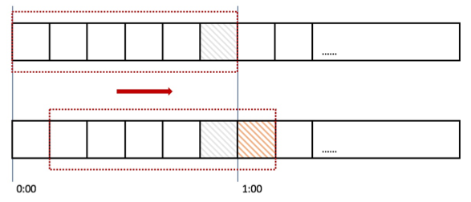

##一、限流

### 1、目的

保护系统，避免被瞬时的大流量打垮系统。引起整体对外服务不可用。

###2、算法

####     	2.1、计数法

​	固定计数法是最简单粗暴的方法，例如AtomicLong counter累计在1s内的请求数。在1s内每次请求counter将increment，当counter>配置限流阈值时触发限流机制。1s后counter将清0，重新开始计数
缺点：

- 1.如果1s内的前100ms，请求已达到了限流配置阈值触发限流机制，而此后的900ms系统虽然处于空闲状态，但依然还是处于限流状态

- 2.计数器清零时临界点问题。例如第一秒的后500ms通过了10个请求，然后第二秒的前500ms通过了10个请求。对于第一秒或者第二秒他们都是ok的，但是如果将第一秒的后500ms和第二秒的前500ms看成一秒，那么就导致了1秒内通过了20个请求，不符合预期。

#### 2.2、滑动窗口


在上图中，整个红色的矩形框表示一个时间窗口，在我们的例子中，一个时间窗口就是一分钟。然后我们将时间窗口进行划分，比如图中，我们就将滑动窗口 划成了6格，所以每格代表的是10秒钟。每过10秒钟，我们的时间窗口就会往右滑动一格。每一个格子都有自己独立的计数器counter，比如当一个请求 在0:35秒的时候到达，那么0:30~0:39对应的counter就会加1。

那么滑动窗口怎么解决刚才的临界问题的呢？我们可以看上图，0:59到达的100个请求会落在灰色的格子中，而1:00到达的请求会落在橘黄色的格 子中。当时间到达1:00时，我们的窗口会往右移动一格，那么此时时间窗口内的总请求数量一共是200个，超过了限定的100个，所以此时能够检测出来触 发了限流。

我再来回顾一下刚才的计数器算法，我们可以发现，计数器算法其实就是滑动窗口算法。只是它没有对时间窗口做进一步地划分，所以只有1格。

由此可见，当滑动窗口的格子划分的越多，那么滑动窗口的滚动就越平滑，限流的统计就会越精确

####     	2.3、漏桶

  漏桶是设定一个固定大小的容器，所有的外部请求都直接存放在容器中，然后容器按照设定的速率处理请求。当请求数超过了容器的大小限制，将触发限流策略，例如拒绝服务。

   

优点:

- 实现简单、策略也比较简单。例如可以直接按照生产者消费者去实现。

缺点：

- 无法应对突发的瞬时流量，对于一些突发的瞬时流量系统其实是可以接受的。因为业务可能都有高峰期和低峰期之分。

####     	2.4、令牌桶

令牌桶算法与漏桶算法相似。令牌桶算法，生成者以恒定的速度生成令牌往令牌桶中存放（决定了QPS阈值）。每个请求尝试从令牌桶中获取令牌，获取到则马上进行执行。否则计算在指定的超时时间内是否能够申请到令牌，获取得到则在队列中等待获取令牌执行。获取不到则触发限流机制。


优点： 

- 对比漏桶算法，当瞬间访问流量变大时，只要令牌桶中的令牌数足够，则可以马上进行执行，不受“漏桶”恒定出水率的限制，体验更好。但需要保证令牌桶的容量不能过大，避免瞬间流量压垮系统。

实现：

基于guava#RateLimiter

```java
RateLimiter rateLimiter = RateLimiter.create(1); //每秒发放一个令牌，也就是QPS=1
rateLimiter.acquire(int permits); //尝试获取n个令牌，获取不到则阻塞，直到获取到
rateLimiter.tryAcquire(int permits) //尝试获取n个令牌，获取不到返回false，不阻塞
rateLimiter.tryAcquire(int permits, long timeout, TimeUnit unit) //可以直接获取到n个令牌或者在timeout时间内可以获得到令牌，返回true。否则返回false。
```

###3、压测

- 负载在 0.7 乘以 内核数 是比较合适的，可以观察load 1 5 15
- cpu使用率在50%左右

##二、熔断

###1、原因

 一个应用中，任意一个服务的不可用或者响应延时都有可能造成整体服务不可用。 更可怕的是，被hang住的请求会很快耗尽系统的资源，当该类请求越来越多，占用的计算机资源越来越多的时候，会导致系统瓶颈出现，造成其他的请求同样不可用，最终导致业务系统崩溃，又称：雪崩效应
 造成雪崩原因可以归结为以下三个：

- 服务提供者不可用（硬件故障，程序Bug，缓存击穿，用户大量请求）
- 重试加大流量（用户重试，代码逻辑重试）
- 服务调用者不可用（同步等待造成的资源耗尽）
- 最终的结果就是一个服务不可用导致一系列服务的不可用，而往往这种后果往往无法预料的。

###2、hystrix

​	1、运行流程图


https://www.jianshu.com/p/e07661b9bae8

https://github.com/Netflix/Hystrix/wiki/How-it-Works


##三、相关链接

<https://juejin.im/entry/5b4d8a8ce51d451908695590>

<https://baike.baidu.com/item/%E6%BC%8F%E6%A1%B6%E7%AE%97%E6%B3%95/8455361?fr=aladdin>

