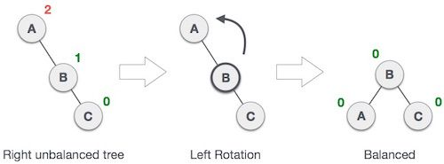
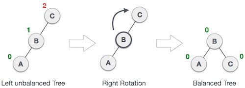

##一、AVL树

### 定义

> 来源：[https://zh.wikipedia.org/wiki/AVL%E6%A0%91](https://zh.wikipedia.org/wiki/AVL树)
> 在[计算机科学](https://zh.wikipedia.org/wiki/计算机科学)中，**AVL树**是最早被发明的[自平衡二叉查找树](https://zh.wikipedia.org/wiki/自平衡二叉查找树)。在AVL树中，任一节点对应的两棵子树的最大高度差为1，因此它也被称为**高度平衡树**。查找、插入和删除在平均和最坏情况下的[时间复杂度](https://zh.wikipedia.org/wiki/时间复杂度)都是O(logn)。增加和删除元素的操作则可能需要借由一次或多次[树旋转](https://zh.wikipedia.org/wiki/树旋转)，以实现树的重新平衡。AVL树得名于它的发明者[G. M. Adelson-Velsky](https://zh.wikipedia.org/wiki/格奥尔吉·阿杰尔松-韦利斯基)和[Evgenii Landis](https://zh.wikipedia.org/w/index.php?title=Evgenii_Landis&action=edit&redlink=1)，他们在1962年的论文《An algorithm for the organization of information》中公开了这一数据结构。

> 节点的**平衡因子**是它的左子树的高度减去它的右子树的高度（有时相反）。带有平衡因子1、0或 -1的节点被认为是平衡的。带有平衡因子 -2或2的节点被认为是不平衡的，并需要重新平衡这个树。平衡因子可以直接存储在每个节点中，或从可能存储在节点中的子树高度计算出来。

### 左旋



### 右旋



### 代码实现

```java
public class balanceTree {
    private TreeNode root;

    public static void main(String[] args) {
        balanceTree tree = new balanceTree();
        tree.root = tree.insert(tree.root,10);
        tree.root = tree.insert(tree.root,20);
        tree.root = tree.insert(tree.root,30);
        tree.root = tree.insert(tree.root,40);
        tree.root = tree.insert(tree.root,50);
        tree.root = tree.insert(tree.root,25);

        System.out.println("OK");
    }

    public TreeNode insert(TreeNode node, int val) {
        if(node == null){
            return new TreeNode(val);
        }

        if(val < node.val){
            // 左树插
            node.leftNode = insert(node.leftNode,val);
            updateHeight(node);
            if(getBalanceFactory(node) == 2){
                // LL型
                if(getBalanceFactory(node.leftNode) == 1){
                    node = rightRotation(node);
                }else if(getBalanceFactory(node.leftNode) == -1) {
                    //LR型
                    node.leftNode = leftRotation(node.leftNode);
                    node = rightRotation(node);
                }
            }
        }else{
            node.rightNode = insert(node.rightNode,val);
            updateHeight(node);
            if (getBalanceFactory(node) == -2){
                if(getBalanceFactory(node.rightNode) == 1){
                    //RL型
                    node.rightNode = rightRotation(node.rightNode);
                    node = leftRotation(node);
                }else if(getBalanceFactory(node.rightNode) == -1){
                    //RR型
                    node = leftRotation(node);
                }
            }
        }
        return node;
    }
  
  
  
    public int getHeight(TreeNode node) {
        if (null == node) {
            return 0;
        }
        return node.height;
    }

  // 更新节点高度
    public void updateHeight(TreeNode node) {
        node.height = Math.max(getHeight(node.leftNode), getHeight(node.rightNode)) + 1;
    }

   //计算平衡因子
    public int getBalanceFactory(TreeNode node) {
        return getHeight(node.leftNode) - getHeight(node.rightNode);
    }

  //左旋
    public TreeNode leftRotation(TreeNode node) {
        TreeNode tmp = node.rightNode;
        node.rightNode = tmp.leftNode;
        tmp.leftNode = node;

        updateHeight(node);
        updateHeight(tmp);
        return tmp;
    }

  //右旋
    public TreeNode rightRotation(TreeNode node) {
        TreeNode tmp = node.leftNode;
        node.leftNode = tmp.rightNode;
        tmp.rightNode = node;

        updateHeight(node);
        updateHeight(tmp);
        return tmp;
    }

}

class TreeNode {
    public int val;
    public int height;
    public TreeNode leftNode;
    public TreeNode rightNode;

    public TreeNode(int val) {
        this.val = val;
        this.height = 1;
    }
}

```

##二、B树

### 定义

> 来源：[https://zh.wikipedia.org/wiki/B%E6%A0%91](https://zh.wikipedia.org/wiki/B树)
> 在[计算机科学](https://zh.wikipedia.org/wiki/计算机科学)中，**B树**（英语：B-tree）是一种自平衡的[树](https://zh.wikipedia.org/wiki/树_(数据结构))，能够保持数据有序。这种数据结构能够让查找数据、顺序访问、插入数据及删除的动作，都在[对数时间](https://zh.wikipedia.org/wiki/时间复杂度#对数时间)内完成。B树，概括来说是一个一般化的[二叉查找树](https://zh.wikipedia.org/wiki/二元搜尋樹)（binary search tree）一个节点可以拥有2个以上的子节点。与[自平衡二叉查找树](https://zh.wikipedia.org/wiki/自平衡二叉查找树)不同，B树适用于读写相对大的数据块的存储系统，例如磁盘。B树减少定位记录时所经历的中间过程，从而加快存取速度。B树这种数据结构可以用来描述外部存储。这种数据结构常被应用在[数据库](https://zh.wikipedia.org/wiki/数据库)和[文件系统](https://zh.wikipedia.org/wiki/文件系统)的实现上。
>
> 一个 *m* 阶的B树是一个有以下属性的树：
>1. 每一个节点最多有 *m* 个子节点
>2. 每一个非叶子节点（除根节点）最少有 ⌈*m*/2⌉ 个子节点
>3. 如果根节点不是叶子节点，那么它至少有两个子节点
>4. 有 *k* 个子节点的非叶子节点拥有 *k* − 1 个键
>5. 所有的叶子节点都在同一层

##三、B+树


##四、红黑树

### 定义

红黑树是每个节点都带有*颜色*属性的[二叉查找树](https://zh.wikipedia.org/wiki/二元搜尋樹)，颜色为*红色*或*黑色*。在二叉查找树强制一般要求以外，对于任何有效的红黑树我们增加了如下的额外要求：
1. 节点是红色或黑色。
2. 根是黑色。
3. 所有叶子都是黑色（叶子是NIL节点）。
4. 每个红色节点必须有两个黑色的子节点。（从每个叶子到根的所有路径上不能有两个连续的红色节点。）
5. 从任一节点到其每个叶子的所有[简单路径](https://zh.wikipedia.org/wiki/道路_(图论))都包含相同数目的黑色节点。

